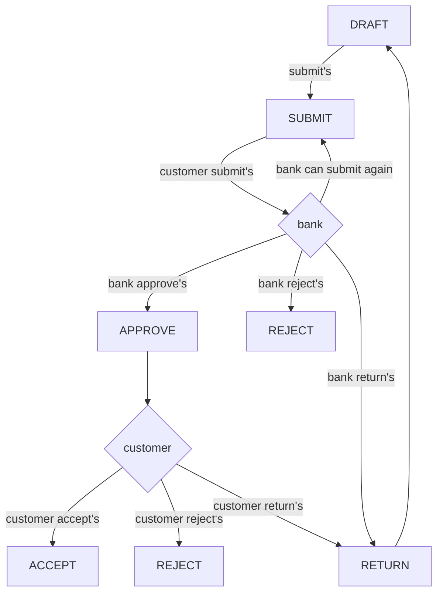
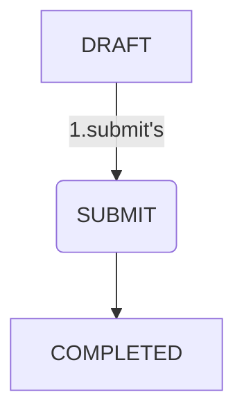
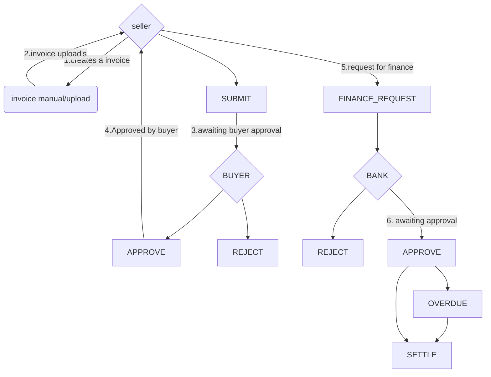

### PROGRAM FLOW 

```mermaid
  graph TD
      A[DRAFT] -->|submit's| B(SUBMIT)
      B --> |customer submit's|C{bank}
      C --> |bank approve's|D[APPROVE]
      C -->|bank can submit again| B[SUBMIT]
      C -->|bank reject's| F[REJECT]
      C --> |bank return's |E[RETURN]
      E --> A 
      D --> G{customer }
      G --> |customer accept's|H[ACCEPT]
      G --> |customer reject's|I[REJECT]
      G --> |customer return's|E
      
```

### INVOICE UPLOAD FLOW

```mermaid
   graph TD
      A[DRAFT] -->|1.submit's| B(SUBMIT)
      B --> C[COMPLETED]   
```

### INVOICE FLOW 

```mermaid
  graph TD
      A --> |1.creates a invoice|Q(invoice manual/upload ) --> |2.invoice upload's|A
      A{seller} -->k[SUBMIT]-->|3.awaiting buyer approval| B{BUYER}
      B --> C[APPROVE]
      B --> D[REJECT]
      C --> |4.Approved by buyer|A
      A --> |5.request for finance|E[FINANCE_REQUEST]
      E --> F{BANK}
      F --> G[REJECT]
      F --> |6. awaiting approval|H[APPROVE]
      H --> I[OVERDUE]
      I --> J[SETTLE]
      H --> J
```